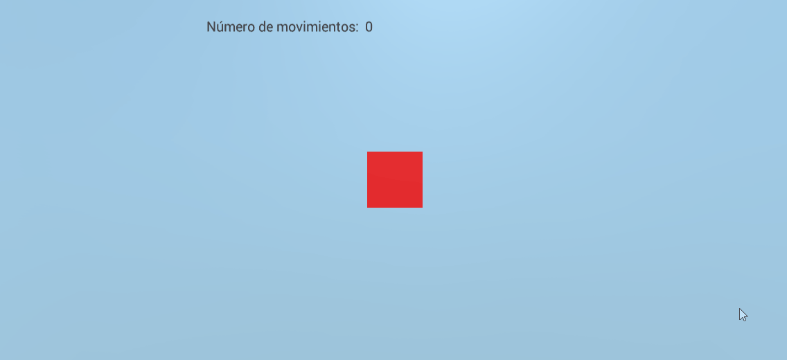
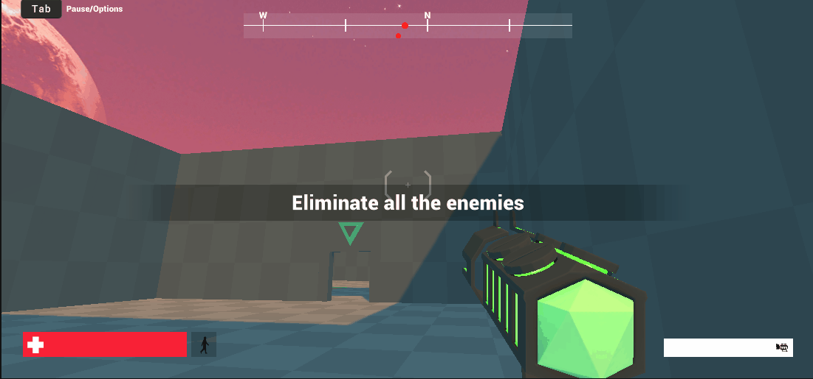

# Práctica 1 - Interfaces Inteligentes
## Fabio Bianchini Cano

---------------

### Introducción 
En esta primera práctica hemos aprendido a dar los primeros pasos en Unity, entre otras cosas a:

- Crear y trabajar con objetos 3D simples.
- Incorporar objetos 3D complejos de la Asset Store
- Utilizar prefabs para probar escenas ya montadas.
- Escribir scripts que interactúen directamente con el entorno de la escena.
--------------
### Gifs

*Cubo en movimiento*

------------------

*Prefab de un fps descargado de la Asset Store*

------------------
------------------
### Scripts
Los scripts incluidos en el repositorio son los que utiliza la primera escena, uno para el movimiento del cubo y el otro para actualizar la UI con el número de movimientos realizados.